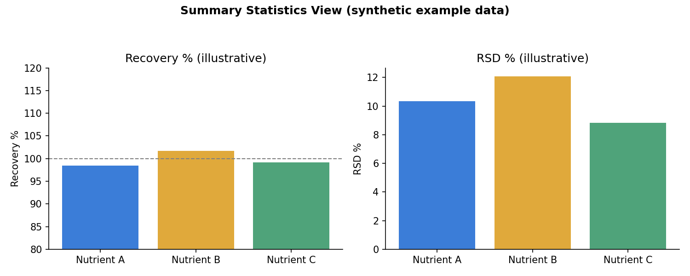
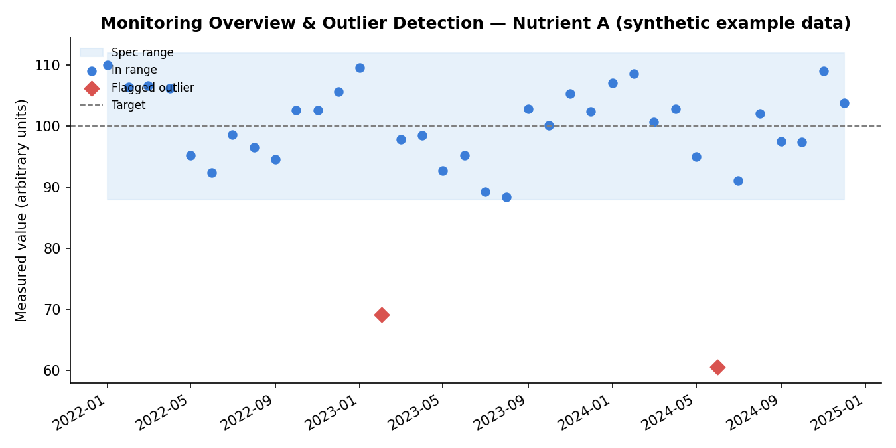
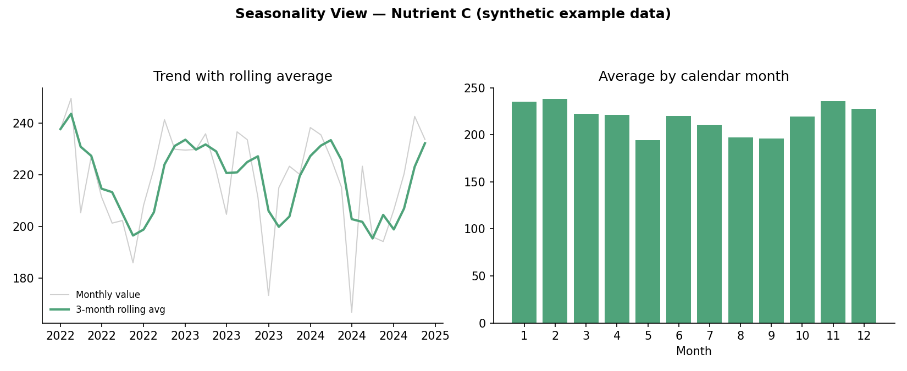
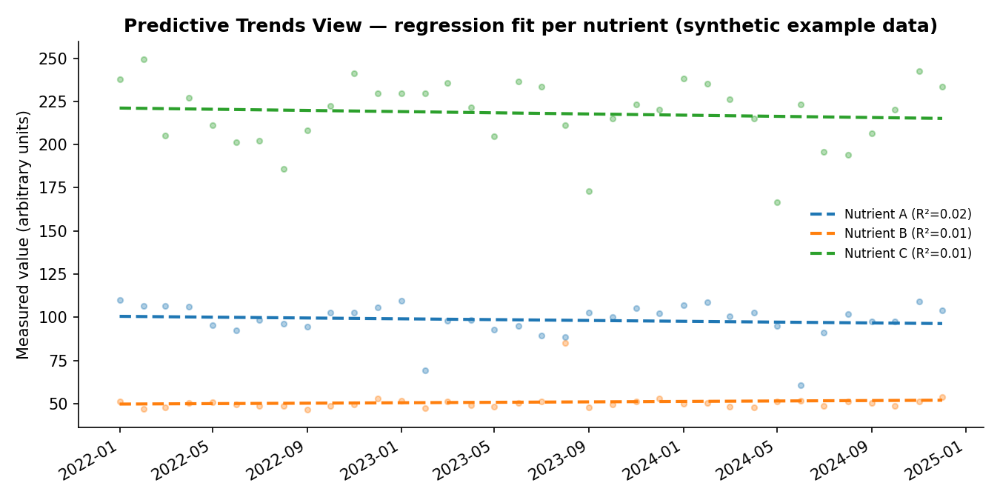

# Automated Nutrient Monitoring & QC Dashboard for Dairy Raw Materials

**Type:** Internship project (industry placement, food/nutrition manufacturing sector)
**Tools:** Power BI, Power Query (M), DAX
**Domain:** Food quality assurance, nutrient compliance, statistical process control

> Note: this case study describes the methodology, data architecture, and analytical
> logic I designed during a six-month industry internship. Company name, internal
> system names, supplier identifiers, and actual specification values have been
> withheld or genericized, as the underlying data is proprietary. All numbers shown
> below are illustrative only.

## Problem

A specialized nutrition manufacturer needed to verify that every batch of a key dairy
raw material met strict nutrient specifications before it could be used in
formulation. Final products in this category are highly sensitive to nutrient
deviations, since both health outcomes and regulatory compliance (e.g. Codex
Alimentarius, EFSA, and other international infant-formula standards) depend on
tight compositional control.

The existing process was entirely manual: lab results were copied into Excel
sheets organized by nutrient, summary statistics (mean, min, max, RSD%, recovery%)
were calculated by hand, and results were checked against specification values
stored in a separate enterprise specification system. This worked for one-off batch
checks but didn't scale: it was slow, error-prone, and gave the team no way to spot
trends, seasonal effects, or supplier-driven variation across batches over time.

**Goal:** turn this into a dynamic, automated analytics system that could ingest
nutrient monitoring data, compare it against specification limits, flag
statistically meaningful deviations, and surface trends, all through a
self-service interactive dashboard.

## Approach

The project was structured into five phases:

1. **Data exploration & structuring** — auditing two source datasets (lab
   monitoring results and specification reference data) that used different
   naming conventions, identifiers, and granularity, and scoping out the
   inconsistencies that needed to be resolved before any modeling could happen.
2. **Data cleaning & transformation** — using Power Query to standardize text
   fields, fix data types, and resolve two major harmonization problems (see
   below).
3. **Data modelling** — designing a star schema to support fast, flexible
   filtering and aggregation.
4. **Statistical measure implementation** — building a DAX-based statistics layer
   to replace the manual Excel calculations, plus outlier detection logic.
5. **Dashboard development** — building an interactive, filterable interface for
   the QA/R&D team.

### Harmonization challenges

Two recurring data problems had to be solved before any meaningful comparison was
possible:

- **Inconsistent nutrient naming.** Lab results referenced nutrients by internal
  lab codes and descriptions, while the specification system used a different
  internal naming convention. A name-mapping table was built to translate both
  into a single "common name" key used throughout the model.
- **Inconsistent units of measurement.** Monitoring results and specification
  targets weren't always reported in the same units (e.g. mg vs. µg vs. ppm). A
  dedicated unit-conversion table held the conversion factors, applied dynamically
  via DAX so that every value was compared on a common basis.

### Data model

A star schema was used to keep the model performant and easy to extend:

- **Fact table:** sample-level monitoring results (raw value, converted value,
  unit, batch/material metadata, test date).
- **Dimension tables:** nutrient name mapping, unit conversion factors,
  specification reference values (target, min, max), a date table for
  time-based analysis, and material/supplier lookups.

This separation meant new nutrients, materials, or time periods could be added
without restructuring the model, and it kept calculations consistent across every
view in the dashboard.

### Statistical methods (DAX layer)

The core analytical layer replaced static Excel formulas with dynamic DAX measures
that recalculate instantly as a user filters the dashboard:

| Metric | Purpose |
|---|---|
| Mean, standard deviation, RSD% | Batch-to-batch variability and process stability |
| Recovery % | Ratio of measured average to specification target |
| Deviation % | Direction and magnitude of difference from target |
| Statistically-derived control limits (UCL/LCL) | Data-driven limits, independent of the fixed specification limits, used to flag values that are statistically anomalous even if technically "in spec" |
| Z-score and modified Z-score outlier detection | Flagging anomalous data points |
| Linear regression (slope, intercept, R²) | Quantifying long-term trend direction and forecast confidence per nutrient |
| Rolling averages, month-over-month % change | Smoothing short-term noise to reveal seasonal patterns |

**Outlier detection** used a modified Z-score (based on median and median absolute
deviation rather than mean/standard deviation), which is more robust to skewed
distributions or values already affected by extreme outliers. A common threshold
of ±3.5 was used to flag potential anomalies (Iglewicz & Hoaglin, 1993), and
flagged values could be optionally excluded from downstream statistics to avoid
distorting the analysis.

### Dashboard

The final deliverable was an interactive Power BI dashboard with several
purpose-built views:

- **Summary statistics** — a nutrient-by-nutrient comparison of measured values
  against specification limits, with automatic flags recommending which
  specifications might need review based on statistically derived limits versus
  the existing fixed targets.
- **Sample-level scatter plot & outlier view** — visualizes every monitoring
  sample over time, color-coded by in-spec/out-of-spec/outlier status, supporting
  manual QA review before deeper analysis.
- **Seasonality view** — monthly/quarterly trend lines with rolling averages,
  designed to surface seasonal patterns known to affect certain micronutrients in
  raw dairy material.
- **Predictive trends view** — regression-based trend lines per nutrient, paired
  with a volatility score (stable / moderate / volatile / highly volatile)
  classification to help prioritize QA attention.

All views shared a common set of slicers (nutrient, material, supplier, time
range), so users could move between a macro overview and a deep dive into a single
nutrient without leaving the dashboard.

> The screenshots below are **not** from the real dashboard. They are
> regenerated mockups built from synthetic data (`code/generate_mock_visuals.py`)
> to illustrate what each view looked like structurally, without exposing any
> real specification values or proprietary data.

**Summary statistics view (mockup):**

**Sample-level scatter plot & outlier detection (mockup):**

**Seasonality view (mockup):**

**Predictive trends view (mockup):**

## Results

- Replaced a fully manual, Excel-based QC workflow with an automated,
  self-service dashboard, removing repetitive manual calculation work.
- Successfully flagged a subset of nutrients where statistically-derived control
  limits diverged meaningfully from the existing fixed specification limits,
  providing a data-driven basis for specification review discussions.
- Surfaced seasonal patterns in select micronutrients consistent with published
  dairy science literature (e.g. winter increases tied to indoor feeding
  regimes), validating that the statistical pipeline was picking up real
  biological signal rather than noise.
- Built in outlier handling so that a small number of extreme or erroneous lab
  values didn't distort summary statistics used for decision-making.

## Limitations & what I'd improve

I think being upfront about limitations is part of doing this kind of work
properly, so a few worth noting:

- **Forecasting reliability was limited.** R² values for the linear regression
  trends were low across most nutrients, meaning the trend lines were useful for
  visualizing direction but not reliable for extrapolating future values.
  Anything claiming "prediction" here should be read as exploratory, not
  production-grade forecasting.
- **Static data refresh.** The dashboard pulled from Excel exports rather than a
  live database connection, so it wasn't truly real-time. A production version
  would benefit from a live pipeline (e.g. a proper data warehouse) instead of
  manual file refreshes.
- **Data completeness varied a lot by nutrient.** Some nutrients had very few
  historical data points, which limits how much confidence you can place in
  their statistics.
- **Scope was limited to one raw material.** The data model was designed to be
  modular, but extending it to other materials would still require additional
  mapping and validation work, not just flipping a switch.
- **Power BI's native modelling has ceilings.** DAX-based regression and
  seasonality measures are reasonable approximations, but proper time-series
  methods (e.g. ARIMA, STL decomposition) would need a tool like Python or R
  alongside it.

## What this demonstrates

This project is less about a single algorithm and more about the kind of
end-to-end data problem that comes up constantly in applied analytics: messy,
inconsistently-labeled real-world data from multiple systems, the need to build
trustworthy statistical QC logic on top of it, and the need to present results in
a way non-technical stakeholders can actually use to make decisions. The
statistical methods involved (RSD%, control limits, robust outlier detection,
regression-based trend analysis) are domain-agnostic and transferable to other QC
or monitoring contexts, including the kind of expression-level quality control
used in transcriptomics pipelines.
